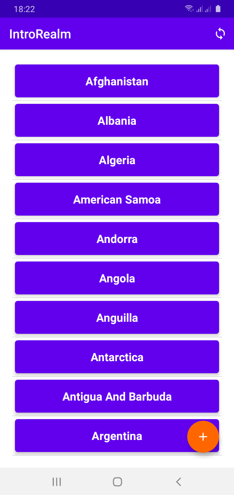
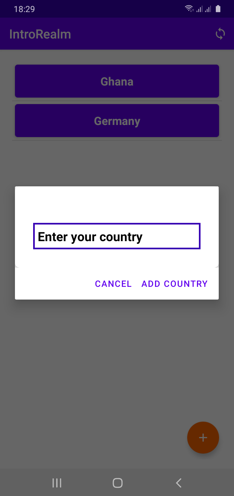

# IntroRealm
Introduction to Realm Database in Android.

Realm’s mobile database is an open source, developer-friendly alternative to CoreData and SQLite.

It is essentially a noSQL database which means that with Realm, you can store and retrieve data that is modeled in means other than tabular relations of relational databases.


## Features of this Project

```
- [x] Swipe to Delete Data .
- [x] Get Data from server.
- [x] Add Data Manually.
- [ ] Update Data.
- [ ] Sync Data to Server.
```


- [x] Swipe to Delete Data .
- [x] Get Data from server.
- [x] Add Data Manually.
- [ ] Update Data.
- [ ] Sync Data to Server.


## ***Preview***

| Home | Add Diaolog|
|   :-------------:|:-------------: |
| ||


| Home | Add Diaolog|
|     ------------- | ------------- |
| | |


## Getting Started


-  Add the classpath dependency in your project level build.gradle in either your existing project or newly created project

```
// Top-level build file where you can add configuration options common to all sub-projects/modules.
buildscript {
    ext.realm_version = "10.4.0"
    ext.gradle_version = "4.1.3"
    ext.kotlin_version = "1.4.32"

    repositories {
        google()
        jcenter()
    }
    dependencies {
        classpath "com.android.tools.build:gradle:$gradle_version"
        classpath "org.jetbrains.kotlin:kotlin-gradle-plugin:$kotlin_version"
        classpath "io.realm:realm-gradle-plugin:$realm_version"
    }
}

allprojects {
    repositories {
        google()
        jcenter()
    }
}

task clean(type: Delete) {
    delete rootProject.buildDir
}

```


-   Add the realm-android plugin at the top of your application level build.gradle . 
If your application uses the Kotlin programming language, you need to apply the kotlin-kapt plugin:

```

plugins {
    id 'com.android.application'
    id 'kotlin-android'
    id 'kotlin-kapt'
    id 'realm-android'
}


android {
    compileSdkVersion 30
    buildToolsVersion "30.0.3"

    defaultConfig {
        applicationId "com.tanacom.introrealm"
        minSdkVersion 16
        targetSdkVersion 30
        versionCode 1
        versionName "1.0"

        testInstrumentationRunner "androidx.test.runner.AndroidJUnitRunner"
    }

    buildTypes {
        release {
            minifyEnabled false
            proguardFiles getDefaultProguardFile('proguard-android-optimize.txt'), 'proguard-rules.pro'
        }
    }
    compileOptions {
        sourceCompatibility JavaVersion.VERSION_1_8
        targetCompatibility JavaVersion.VERSION_1_8
    }
    kotlinOptions {
        jvmTarget = '1.8'
    }
}

dependencies {

    implementation 'org.jetbrains.kotlin:kotlin-stdlib:$kotlin_version'
    implementation 'androidx.core:core-ktx:1.3.2'
    implementation 'androidx.appcompat:appcompat:1.2.0'
    implementation 'com.google.android.material:material:1.3.0'
    implementation 'androidx.constraintlayout:constraintlayout:2.0.4'
    testImplementation 'junit:junit:4.13.2'
    androidTestImplementation 'androidx.test.ext:junit:1.1.2'
    androidTestImplementation 'androidx.test.espresso:espresso-core:3.3.0'
    implementation 'io.realm:android-adapters:3.1.0'
    implementation 'com.android.volley:volley:1.2.0'
}


```


- Initialize the Realm App in your base Application.

```

class IntroRealmApp : Application() {

    override fun onCreate() {
        super.onCreate()
        
        Realm.init(this)


      val config = RealmConfiguration.Builder()
            .name(REALM_NAME).build()

        Realm.setDefaultConfiguration(config)

    }


}


```


- Add your application name to the AndroidManifest

```

<application
   android:name=".IntroRealmApp"
   ...
/>

```

## Documentation

* Check out more from the SDK
[MongoDB Realm Android SDK](https://docs.mongodb.com/realm/sdk/android/)


* Check out the REST API for countries
[REST API for countries](https://www.universal-tutorial.com/rest-apis/free-rest-api-for-country-state-city)


